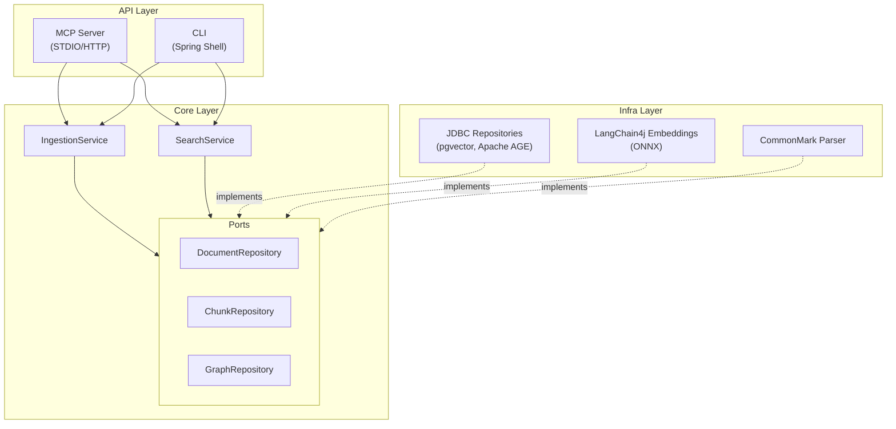

# Alexandria


A RAG (Retrieval-Augmented Generation) system for personal technical documentation. Index your markdown files and query them semantically via MCP server for Claude Code integration.

## Features

- **Semantic Search**: Find relevant documentation using natural language queries
- **Hybrid Search**: Combines vector similarity with full-text search (RRF fusion)
- **Hierarchical Chunking**: Child chunks for matching, parent chunks for context
- **Document Graph**: Apache AGE tracks document relationships via cross-references
- **MCP Integration**: Native Claude Code integration via STDIO or HTTP/SSE transport
- **CLI Interface**: Command-line tools for maintenance and manual operations
- **Local Embeddings**: all-MiniLM-L6-v2 via ONNX, no external API required

## Tech Stack

- Java 21, Spring Boot 3.4.7
- LangChain4j 1.2.0
- PostgreSQL 17 with pgvector 0.8.1 and Apache AGE (PG17)
- Spring AI MCP Server 1.0.0
- Spring Shell 3.4.1

## Quick Start with Docker

The easiest way to run Alexandria - no Java or Maven installation required.

### Prerequisites

- Docker 20.10+ with Docker Compose V2
- 4GB available RAM (2GB for app + 2GB for database)
- Git

### 1. Clone and Configure

```bash
git clone https://github.com/sebc-dev/alexandria.git
cd alexandria

# Create your configuration
cp .env.example .env

# Edit .env to set your documentation path
# DOCS_PATH=/path/to/your/docs
```

### 2. Start Services

```bash
docker compose up -d

# Wait for services to be healthy (~2 minutes for ONNX model loading)
docker compose ps
```

### 3. Index Your Documentation

```bash
./alexandria index --path /docs
```

### 4. Search

```bash
./alexandria search --query "how to configure logging"
```

### CLI Commands (Docker)

```bash
./alexandria index --path /docs      # Index documentation
./alexandria search --query "text"   # Search documentation
./alexandria status                  # Show database status
./alexandria clear --force           # Clear all indexed data
```

### Docker Architecture

Alexandria runs as two containers:

```
┌─────────────────────────────────────────────────────────────┐
│                     Docker Compose                          │
├─────────────────────────────────────────────────────────────┤
│  ┌─────────────────────┐    ┌─────────────────────────────┐ │
│  │   alexandria-app    │    │       rag-postgres          │ │
│  │   (Java 21 + ONNX)  │───▶│  (PostgreSQL 17 + pgvector  │ │
│  │   Port: 8080        │    │   + Apache AGE)             │ │
│  │   Memory: 2GB       │    │   Port: 5432                │ │
│  └─────────────────────┘    └─────────────────────────────┘ │
│          │                              │                   │
│          ▼                              ▼                   │
│     /docs (ro)                    ./data (persist)          │
└─────────────────────────────────────────────────────────────┘
```

### Environment Variables

All configuration is done via `.env` file. Copy `.env.example` to `.env` and customize:

| Variable | Default | Description |
|----------|---------|-------------|
| `DOCS_PATH` | `./docs` | Host path to markdown documentation (mounted read-only) |
| `LOG_LEVEL` | `INFO` | Logging level: DEBUG, INFO, WARN, ERROR |
| `MEM_LIMIT` | `2g` | App container memory limit (min 2GB recommended) |
| `DB_HOST` | `postgres` | PostgreSQL host (use default for bundled container) |
| `DB_PORT` | `5432` | PostgreSQL port |
| `DB_NAME` | `alexandria` | Database name |
| `DB_USER` | `alexandria` | Database username |
| `DB_PASSWORD` | `alexandria` | Database password |

### Docker Operations

```bash
# Start all services
docker compose up -d

# View container status
docker compose ps

# View application logs
docker compose logs -f app

# View database logs
docker compose logs -f postgres

# Restart application only
docker compose restart app

# Stop all services
docker compose down

# Reset database (delete all data)
docker compose down && rm -rf data/ && docker compose up -d

# Rebuild images after code changes
docker compose build --no-cache && docker compose up -d
```

### Health Checks and Troubleshooting

Both containers have health checks configured:

```bash
# Check services health status
docker compose ps

# Check app health endpoint
curl http://localhost:8080/actuator/health

# Check if database is ready
docker compose exec postgres pg_isready -U alexandria
```

**Startup times:**
- PostgreSQL: ~30 seconds
- Application: ~2 minutes (ONNX model loading)

**Common issues:**

| Symptom | Cause | Solution |
|---------|-------|----------|
| App container restarting | Insufficient memory | Increase `MEM_LIMIT` to 4g in `.env` |
| Slow startup | ONNX model loading | Wait 2 minutes, this is normal |
| Database connection refused | Postgres not ready | Wait for postgres healthcheck to pass |
| "Out of memory" in logs | Large documentation set | Increase `MEM_LIMIT` and Docker memory |

### Memory Configuration

The application requires significant memory for the ONNX embedding model:

- **Minimum**: 2GB (small documentation sets)
- **Recommended**: 4GB (large documentation sets)
- **PostgreSQL**: Uses 3GB shared memory for HNSW index operations

To increase memory, edit `.env`:
```bash
MEM_LIMIT=4g
```

For Docker Desktop, also ensure Docker has sufficient memory allocated in Settings > Resources.

### MCP Integration (Docker - HTTP/SSE)

For Docker deployments, add to your Claude Code settings:

```json
{
  "mcpServers": {
    "alexandria": {
      "type": "sse",
      "url": "http://localhost:8080/sse"
    }
  }
}
```

---

## Quick Start (Traditional)

For local development or when you prefer running without Docker.

### Prerequisites

- Java 21+
- Maven 3.8+
- Docker & Docker Compose (for database only)

### 1. Start the Database

```bash
docker compose up -d postgres
```

This starts PostgreSQL with pgvector and Apache AGE extensions.

### 2. Build the Application

```bash
mvn clean package -DskipTests
```

### 3. Index Documentation

```bash
java -jar target/alexandria-0.1.0-SNAPSHOT.jar index --path /path/to/docs
```

### 4. Configure Claude Code (Traditional - STDIO)

Copy `.mcp.json` to your project or merge with existing configuration:

```json
{
  "mcpServers": {
    "alexandria": {
      "type": "stdio",
      "command": "java",
      "args": [
        "--enable-native-access=ALL-UNNAMED",
        "-jar",
        "/path/to/alexandria-0.1.0-SNAPSHOT.jar",
        "--spring.profiles.active=mcp"
      ],
      "env": {
        "SPRING_DATASOURCE_URL": "jdbc:postgresql://localhost:5432/alexandria?sslmode=disable",
        "SPRING_DATASOURCE_USERNAME": "alexandria",
        "SPRING_DATASOURCE_PASSWORD": "alexandria"
      }
    }
  }
}
```

## MCP Tools

When integrated with Claude Code, the following tools become available:

| Tool | Description |
|------|-------------|
| `search_docs` | Semantic search with optional category/tag filters |
| `index_docs` | Index markdown files from a directory |
| `list_categories` | List available documentation categories |
| `get_doc` | Get full document details by ID |

## CLI Commands

```bash
# Index markdown files
java -jar target/alexandria-*.jar index --path /path/to/docs

# Search documentation
java -jar target/alexandria-*.jar search --query "how to configure logging" --limit 10

# Show database status
java -jar target/alexandria-*.jar status

# Clear all indexed data
java -jar target/alexandria-*.jar clear --force
```

## Document Format

Alexandria indexes markdown files with optional YAML frontmatter:

```markdown
---
title: My Document Title
category: conventions
tags:
  - java
  - architecture
---

# Document Content

Your documentation content here...
```

Supported frontmatter fields:
- `title`: Document title (falls back to first H1 or filename)
- `category`: Classification for filtering
- `tags`: List of tags for filtering

## Architecture



Hexagonal architecture enforced by ArchUnit tests. Dependencies flow inward: API and Infra depend on Core, never the reverse.

## Development

```bash
# Run unit tests
mvn test

# Run integration tests (requires Docker)
mvn verify

# Full build with all tests
mvn clean verify
```

## Configuration

Key application properties:

| Property | Default | Description |
|----------|---------|-------------|
| `alexandria.mcp.allowed-paths` | `${user.home}` | Directories allowed for indexing via MCP |
| `spring.datasource.url` | - | PostgreSQL connection URL |

## License

MIT
